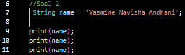
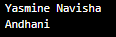
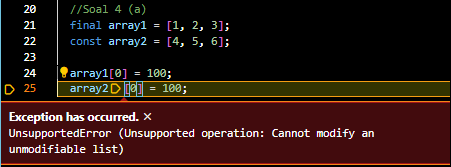
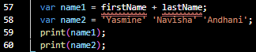

# Laporan Kuis 1 Pemrograman Mobile 

### Nama  : Yasmine Navisha Andhani
### NIM   : 2141720047
### Kelas : D4-TI / 3G
##

**Soal 1**

*Jawaban soal 1* : 

Digunakan untuk mencetak atau menampilkan teks "Hello world".

**Soal 2**

*Jawaban soal 2* :

String name = 'Yasmine Navisha Andhani'; : Merupakan deklarasi variabel name yang memiliki tipe data String (string) dan diberi nilai 'Yasmine Navisha Andhani'. 

print(name); : Merupakan pernyataan yang mencetak isi variabel name. 

**Soal 3**

*Jawaban soal 3* :

String firstName = 'Yasmine Navisha'; : Ini adalah deklarasi variabel firstName yang memiliki tipe data String (string) dan diberi nilai 'Yasmine Navisha'.

final lastName = 'Andhani'; : Merupakan deklarasi variabel lastName yang menggunakan kata kunci final. Dalam Dart, 'final' digunakan untuk mendeklarasikan konstanta, yang berarti nilai variabel ini tidak dapat diubah setelah diberikan nilai pertama kali. Variabel lastName juga memiliki tipe data String dan diberi nilai 'Andhani'.

print(firstName); : Ini adalah pernyataan yang mencetak isi variabel firstName.

print(lastName); : Ini adalah pernyataan yang mencetak isi variabel lastName.

**Soal 4 (a)**

*Jawaban soal 4 (a)* :

Kode di atas menghasilkan kesalahan saat dijalankan karena mengubah nilai elemen dalam array array2, yang dideklarasikan menggunakan kata kunci konstanta. Array yang dideklarasikan dengan const tidak dapat diubah setelah diberikan nilai awal.

final array1 = [1, 2, 3]; : Merupakan deklarasi variabel array1 yang diberi nilai awal sebagai array [1, 2, 3].

const array2 = [4, 5, 6]; : Merupakan deklarasi variabel array2 yang diberi nilai awal sebagai array [4, 5, 6].

array1[0] = 100; : Untuk mengganti nilai elemen pertama dalam array1 menjadi 100, benar karena array1 dideklarasikan dengan final dan dapat diubah.

array2[0] = 100;: Untuk mengganti nilai elemen pertama dalam array2 menjadi 100, tetapi ini akan menghasilkan kesalahan karena array2 dideklarasikan dengan const dan tidak dapat diubah.

Karena mencoba mengubah elemen dalam array2 yang dideklarasikan sebagai const, kode tersebut akan menghasilkan error.

**Soal 4 (b)**

*Jawaban soal 4 (b)* :

int number1 = 100; : Merupakan deklarasi variabel number1 yang memiliki tipe data int (bilangan bulat) dan diberi nilai 100. 

double number2 = 100.5; : Ini adalah deklarasi variabel number2 yang memiliki tipe data double (bilangan desimal) dan diberi nilai 100.5.

print(number1); : Merupakan pernyataan untuk mencetak isi variabel number1.

print(number2); : Merupakan pernyataan untuk mencetak isi variabel number1.

**Soal 5**

*Jawaban soal 5* :

num number = 10; : Merupakan deklarasi variabel number dengan tipe data num yang diberi nilai awal 10. Karena tipe data num dapat mewakili bilangan bulat atau bilangan desimal, maka inisialisasi dengan nilai bulat seperti 10 adalah benar.

print(number); : Merupakan pernyataan untuk mencetak isi variabel number.

number = 10.5;: Merupakan pernyataan untuk  mengubah nilai variabel number menjadi 10.5. Karena tipe data num dapat mewakili bilangan desimal, maka perubahan ini adalah benar.

print(number); : Merupakan pernyataan lain untuk mencetak isi variabel number setelah perubahan nilai.

**Soal 6**

*Jawaban soal 6* :

String firstName = 'Yasmine Navisha'; : Merupakan deklarasi variabel firstName dengan tipe data String yang diberi nilai 'Yasmine Navisha'. Variabel ini digunakan untuk menyimpan nama depan.

String LastName = 'Andhani'; : Merupakan deklarasi variabel LastName dengan tipe data String yang diberi nilai 'Andhani'. Variabel ini digunakan untuk menyimpan nama belakang.

var fulName = '$firstName ${LastName}'; : Merupakan deklarasi variabel fulName menggunakan kata kunci var. Menggunakan interpolasi string dengan menggunakan simbol $ untuk menyisipkan nilai variabel ke dalam string. 

print(fulName); : Merupakan pernyataan yang mencetak isi variabel fulName.

**Soal 7**

*Jawaban soal 7* :

Fungsi dari kode Dart di atas adalah mendeklarasikan variabel text yang berisi string dengan penggunaan karakter escape (\' untuk tanda kutip tunggal dan \$ untuk tanda dollar) dan kemudian mencetak string tersebut. 

**Soal 8**

*Jawaban soal 8* :

var name1 = firstName + lastName; : Merupakan deklarasi variabel name1 yang berusaha menggabungkan nilai dari dua variabel sebelumnya, firstName dan lastName. Namun, sebelumnya tidak didefinisikan atau memberi nilai pada kedua variabel tersebut, jadi akan error jika di running.

var name2 = 'Yasmine' 'Navisha' 'Andhani'; : Merupakan deklarasi variabel name2 yang mencoba menggabungkan tiga string secara berurutan tanpa operator penggabungan. Akan terjadi error, karena harus menggunakan operator penggabungan seperti + atau .. untuk menggabungkan string dalam Dart.

**Soal 9**

*Jawaban soal 9* :

var name2 = 'Yasmine' ' Navisha ' ' Andhani'; : Pada bagian ini, mencoba menggabungkan tiga string secara berurutan tanpa menggunakan operator penggabungan seperti +. Namun, tidak dimasukkan tanda kutip di antara string-string tersebut, sehingga Dart menganggapnya sebagai satu string panjang. 

*perbaikan*

**Soal 10**

*Jawaban soal 10* :

var kalmiat_panjang = ''' ... '''; : Merupakan deklarasi variabel kalmiat_panjang. Kita menggunakan tanda kutip tiga (''') untuk mendefinisikan string multi-baris.
